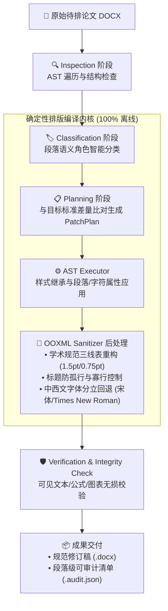

# 🌿 Paper Setting (学术论文智能排版工作台)

> **100% 纯本地确定性编译 · 零云端通信捍卫论文隐私 · 彻底终结大模型排版幻觉与格式跑版**

[](LICENSE)
[](https://www.python.org/)
[]()
[]()
[]()

---

## ⚡ 为什么选择 Paper Setting？

面对学位论文和科技论文繁琐的排版要求，传统排版工具与通用大语言模型存在无法调和的痛点：

| 评估维度 | 传统 Word 宏 / 格式刷 | 通用大语言模型 (ChatGPT/Kimi) | 🌿 **Paper Setting** |
| :--- | :--- | :--- | :--- |
| **论文隐私** | 本地运行，易崩溃卡死 | ⚠️ 全文上传第三方公有云，存在未发表泄密风险 | 🛡️ **100% 单机沙箱，零网络通信，绝不上云** |
| **内容保真** | 跨版本容易跑版 | ⚠️ 概率生成易篡改文本，破坏公式与复杂表格 | 🔒 **AST 确定性解析，物理无损，公式图表原生保真** |
| **规范精确度** | 依赖手动调试，极易错漏 | ⚠️ “看着像”，无法精准对齐毫米级版心与三线表 | 📐 **确定性编译，毫米级严格对齐国标与高校规范** |
| **速度与成本** | 耗费数小时人工调整 | 耗时长，单次消耗上万 Token | ⚡ **纯本地纯算，1.5 秒内极速交付，0 Token 成本** |
| **可审计性** | 无法回溯修改痕迹 | 无法生成精确 Diff 审计 | 📝 **段落级可回溯 Diff 清单与人话修改摘要** |

---

## ✨ 核心特性

- 🎯 **双视图交互设计**：
  - **默认极简流**：传稿 $\rightarrow$ 选标准 $\rightarrow$ 秒级排版 $\rightarrow$ 导出 DOCX 与 **X-Ray 实时透视比对**。
  - **详细与 Agent 智排**：高校杂乱通知智能提取、人机安全回环（HITL 段落审核）、AI 学术二次盲审质检。
- 🛠️ **出版级 OOXML 物理重构**：
  - **学术三线表 (Booktabs)**：顶底线 1.5pt、栏目线 0.75pt、表头跨页自动重复 (`tblHeader`) 与行防截断 (`cantSplit`)。
  - **标题防孤行体系**：全篇标题注入 `keepNext` 与 `keepLines`，杜绝标题单独遗留在页脚；正文开启寡行控制 (`widowControl`)。
  - **中西文字体分立**：中文宋体/黑体，西文 Times New Roman，彻底清除游离混杂字体。
- 🛡️ **开箱即用体验**：内置【📄 一键载入演示论文初稿】，无需提供真实个人文档即可体验全流程。

---

## 🏛️ 系统架构



---

## 🚀 30 秒极速上手 (Quick Start)

### 1. 安装依赖
```bash
git clone https://github.com/beiningwuyou/paper-setting.git
cd paper-setting

# 使用 pip 或 uv 安装
pip install -e .
```

### 2. 启动工作台
```bash
# 运行标准启动脚本
./start.sh
```
服务启动后，在浏览器访问 `http://127.0.0.1:8765`，点击【📄 一键载入演示论文初稿】即可体验！

---

## 🤖 作为 MCP Server 接入各大 AI 智能体

Paper Setting 原生实现了 Model Context Protocol (MCP)，可作为排版工具无缝接入 **Cursor**、**Trae**、**腾讯 WorkBuddy** 或 **Claude Desktop**。

在你的 MCP 配置文件中添加：

```json
{
  "mcpServers": {
    "paper-setting": {
      "command": "uv",
      "args": ["run", "--directory", ".", "paper-setting-mcp"]
    }
  }
}
```

---

## 📚 进阶文档

- 🔬 [进阶技术规格与深度架构说明](docs/TECHNICAL_SPECIFICATIONS.md)：学校模板合成、深层 OOXML 节点修剪与分层排版策略。
- 🤖 [Agent 调度实录与能力展现](docs/AGENT_CAPABILITY_SHOWCASE.md)：双向 Agent 调度与 Native macOS 客户端实践。
- 📜 [第三方开源依赖与协议说明](docs/THIRD_PARTY_LICENSES.md)。

---

## 📄 开源许可证

本项目基于 [MIT License](LICENSE) 授权，欢迎学术界与开发者共同参与维护各大高校排版规约库！


