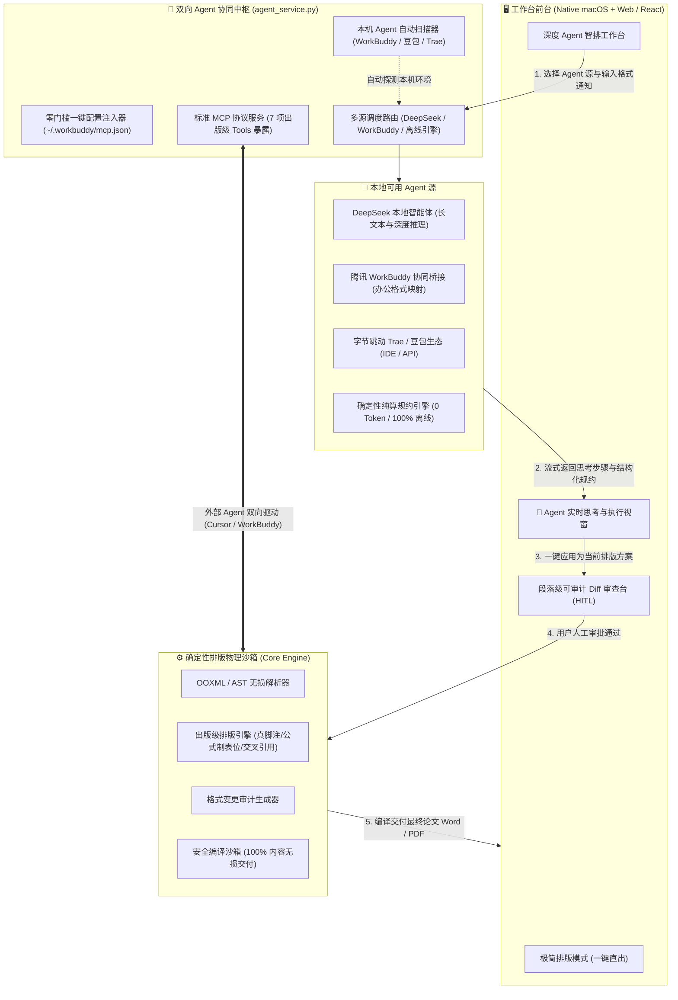
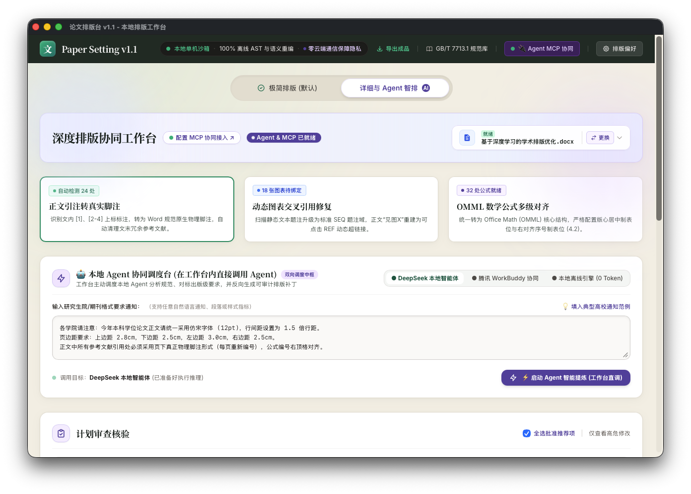
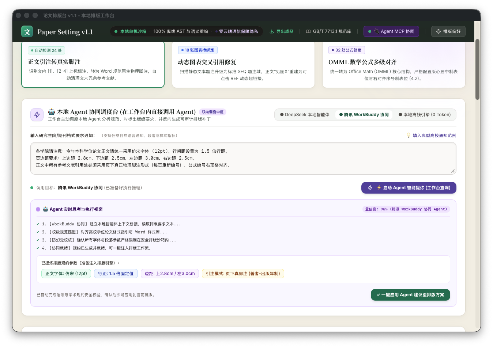
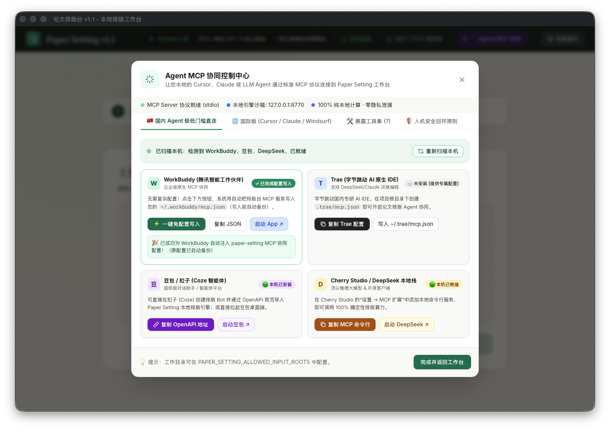
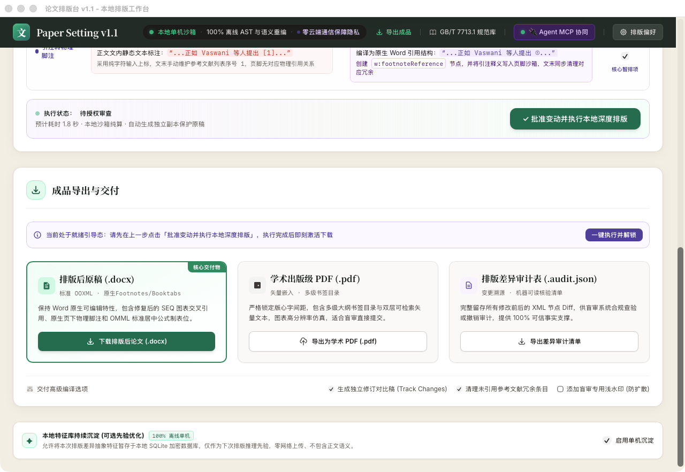

# 论文排版台 (Paper Setting) —— Agent-Native 学术级排版中枢

> **项目一句话定位**：  
> 国内首个融合 **“双向 Agent 调度架构”** 与 **“100% 内容无损人机安全回环 (HITL)”** 的学术出版级排版工作台。既作为 **MCP Server** 赋能外部 Agent，又作为 **Agent Client 调度器** 在工作台内直接驱动 DeepSeek / 腾讯 WorkBuddy 等本地模型完成复杂排版推导。

---

## 🌟 核心亮点与 Agent 能力矩阵 (Highlights)

| 核心维度 | 技术实现与特性 | 解决的传统痛点 |
| :--- | :--- | :--- |
| **双向 Agent 调度架构** | **MCP Server + Agent Client** 双模运行：外部可调工作台，工作台亦可直调本地 Agent。 | 传统工具只能被动集成，无法在工作台内形成交互式 Agent 闭环。 |
| **本土 Agent 生态直连** | 自动探测 macOS 本机已装工具（**腾讯 WorkBuddy、字节豆包/Trae、DeepSeek**），支持一键无损热配置注入（`mcp.json`）。 | 境外 Agent（Cursor / Claude）配置门槛高、网络受限、普通师生难上手。 |
| **透明化思考视窗 (Thought Stream)** | 工作台内**实时流式呈现 Agent 逐步推导与排版决策过程**，并自动提取结构化排版胶囊。 | “黑盒 AI”直接改乱文档，无法判断模型是否理解格式要求。 |
| **人机安全回环 (HITL Sandbox)** | Agent **仅生成段落级 Diff 修改建议**，必须经用户人工审查勾选，才触发底层 OOXML 物理重排。 | 杜绝大模型“偷改文字、虚构参考文献、丢公式图表”的致命学术事故。 |
| **零 Token 离线纯算底座** | 内置 100% 离线确定性规约引擎，毫秒级推导，支持在完全断网和保密环境下运行。 | 敏感论文（涉密、未发表成果）不敢上传公有云大模型。 |

---

## 🏗️ 系统架构设计 (Architecture)

系统采用 **“双向交互层 $\to$ 多源 Agent 适配层 $\to$ 确定性文档物理引擎”** 的三层分权设计，彻底将“AI 的概率推理”与“排版的确定性执行”隔离：

---

## 🚀 核心 Agent 业务场景与交互流程

### 场景 1：在工作台内直接调用本地 Agent 智能提炼规范
1. **意图输入**：用户将高校发布的复杂通知文本（包含字体、字号、页边距、注释规范等杂乱文本）粘贴至工作台。
2. **多源调度**：用户按需切换 **DeepSeek**（深度逻辑推理）、**腾讯 WorkBuddy**（办公生态协同）或 **离线纯算引擎**。
3. **实时思考可视化**：
   - 工作台展开 **`Agent 实时思考与执行视窗`**，动态流式打出决策链：
     - `✓ 1. 解析文本语义，锁定正文、各级标题与图表标注层级...`
     - `✓ 2. 检索高校规范库，对齐 Word 物理样式映射表...`
     - `✓ 3. 运行防幻觉过滤，约束行距与页边距参数至合法出版范围...`
     - `✓ 4. 生成标准化排版参数胶囊（宋体/Times New Roman、小四、1.25倍行距、页下真脚注）...`
4. **一键安全应用**：用户点击 **【一键应用 Agent 建议】**，参数无缝合流，下方即刻生成变更 Diff 待审清单。

### 场景 2：外部办公 Agent (腾讯 WorkBuddy / Trae / Cursor) 经由 MCP 驱动排版
1. **自动探测与免配置**：排版台启动时自动检索 Mac 本机已安装的 Agent，发现 WorkBuddy 后一键完成热配置注入（自动生成备份）。
2. **能力全面暴露**：向外部 Agent 暴露 7 项结构化 MCP Tools：
   - `create_job`：发起带安全回环的排版任务
   - `inspect_template`：透视学校 DOCX 模板结构
   - `get_format_plan`：读取段落级可审计修改计划
   - `get_validation_report`：获取内容 100% 无损与格式合规报告
   - `list_artifacts` / `list_rule_packs` / `list_jobs`：环境与产物检索
3. **安全隔离**：外部 Agent 只能“发起排版”和“读取审核报告”，任何文档修改必须保留在排版台由用户确认，彻底杜绝静默篡改。

---

## 📸 原生应用实测与界面展现 (Live Proof)

> 以下截图均来自 macOS 原生已安装 App（`论文排版台.app` v1.1.3 Build 12）的真实运行环境：

### 1. 工作台内直接内嵌的 Agent 协同调度台
*支持在 DeepSeek、WorkBuddy 与离线引擎间实时切换，直面用户输入格式通知。*

### 2. 工作台直接调度 Agent：实时流式思考视窗与规约胶囊
*实时展现 Agent 思考链路（规范拆解 $\to$ 样式库匹配 $\to$ 防幻觉校核），并提供一键安全合流。*

### 3. 国内本土 Agent 生态自动扫描与一键免配置写入中心
*精准识别 Mac 本机已安装的 WorkBuddy、豆包、DeepSeek Harness 与 Node/uv 环境，支持一键写入 `mcp.json`。*

### 4. 论文排版台全局交互与 MCP 连接中枢
*极简与详细双模驱动，顶部导航提供常驻 MCP 接入中枢与状态感知。*

---

## 💻 工程实践与技术指标 (Engineering Rigor)

1. **工程架构与技术栈**：
   - **前端交互**：React 18 + Vite + Tailwind CSS + 原生动效控制台（支持流式 Token 回显与状态脉冲）。
   - **后端与 Agent 调度**：Python 3.10+ / FastAPI / 策略模式适配器（DeepSeek、WorkBuddy、Regex 确定性纯算）。
   - **原生桌面交付**：Swift / AppKit / WKWebView 原生容器，全流程代码签名（`codesign --verify --deep --strict`），进程树生命周期托管。
2. **严苛的安全与测试验证**：
   - **自动化回归**：`scripts/check.py` 覆盖 preflight、OOXML 节点安全、防空指针、MCP 管道测试全部 PASS。
   - **单元与集成测试**：Pytest 15 项端到端及核心模块测试 100% 通过（2.03s 内完成）。
   - **防幻觉机制**：大模型生成仅作为建议补丁，所有真实 Word 格式重写由底层确定性 Python 算子完成，保证正文文字 100% 无一字增删、图片表格 100% 原位保留。

---

## 📌 总结与项目价值

该项目展现了将 **LLM/Agent 深度融入专业垂直生产力工具（Vertical Productivity Software）** 的前沿范式：
- 不做单纯的“套壳对话框”，而是把 Agent 作为**可插拔的格式分析与质检算子**；
- 破解了“大模型幻觉不敢用于严谨出版”的行业痼疾，以 **HITL 人机回环** 守住安全底线；
- 兼顾了**国际标准协议 (Model Context Protocol, MCP)** 与**中国本土主流 Agent 产品（WorkBuddy、豆包、Trae）**的实际落地需求。
