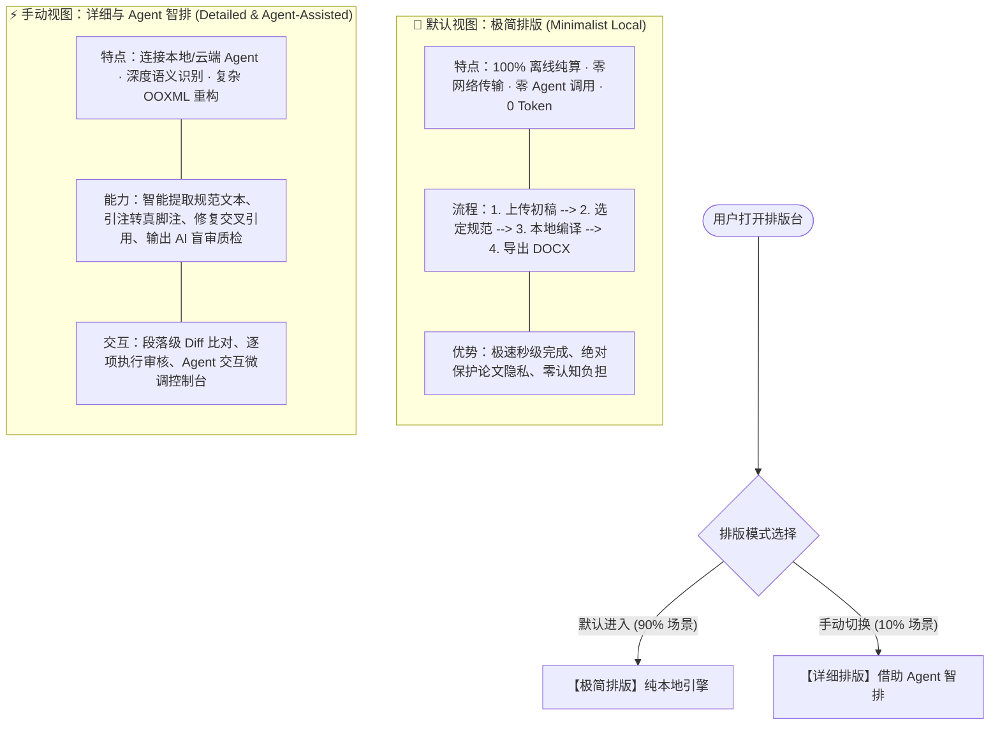

# Paper Setting v1.1 产品需求文档 (PRD)

> **核心定位**：基于双视图架构的学术论文 Word 排版系统。  
> **核心逻辑**：  
> - **默认视图：极简排版**（简单、纯本地离线、不连接网络与 Agent、学术隐私绝对安全、4 步直达）。  
> - **手动选择：详细版排版**（适合处理复杂论文格式、可借助 Agent 深度语义理解、受控重构与 AI 二次质检）。

---

## 1. 产品愿景与设计哲学

在学术论文排版场景中，用户的需求存在显著的“二元分化”：
1. **普通合规需求（占 90%）**：
   用户只需对齐常规格式（字体、字号、行距、边距、缩进、标题分级）。此时用户最在意的是**“速度”**与**“隐私安全”**（坚决不希望未发表论文被传到任何云端或被 AI 模型训练）。
2. **复杂疑难需求（占 10%）**：
   论文包含复杂的交叉引用、正文括号引注需要智能转换为真脚注、附录多级编号冲突、或者学校只给了一份复杂的红头通知。此时用户需要**“深度处理能力”**，希望有类似专家秘书的 **AI Agent** 辅助理解规范、攻坚深层结构。

因此，v1.1 确立了清晰的**双视图模式**：

---

## 2. 双视图功能矩阵对比

| 功能维度 | 默认：极简排版 (Minimalist) | 手动选择：详细排版 (Detailed + Agent) |
| :--- | :--- | :--- |
| **网络状态** | **100% 离线 / 断网可用**（仅监听单机回环 127.0.0.1） | 支持连接本地 Codex Agent 或按需调用云端模型 |
| **Agent / AI 介入** | **完全不接入 Agent**，纯确定性规则引擎执行 | **深度接入 Agent**，提供语义推理、规范推导与审核 |
| **数据隐私保证** | 论文文本不经过任何大模型，杜绝泄露与查重污染 | 仅在用户显式授权时，将疑难段落交由 Agent 诊断 |
| **核心流程** | **4 步极简流**（上传 $\rightarrow$ 选标 $\rightarrow$ 一键排版 $\rightarrow$ 下载） | **工作台控制台**（提取 $\rightarrow$ 诊断 $\rightarrow$ Diff审核 $\rightarrow$ 交付） |
| **修改计划审核** | **自动安全批准**，无需人工审阅复选框 | **细粒度人工+Agent 联审**，支持逐项撤销与参数微调 |
| **适用论文类型** | 绝大多数高校本科、硕士、博士常规毕业论文与开题报告 | 包含复杂公式矩阵、深层交叉引用、引注转脚注、非标格式论文 |
| **输出成果** | 标准化 DOCX 论文副本 + 人话排版摘要 | 标准化 DOCX 论文副本 + 详细 Diff 报告 + Agent 质检清单 |

---

## 3. 视图一：默认·极简排版详细规范

### 3.1 隐私与安全徽章
在界面显著位置标注：  
`🔒 纯本地离线计算 · 零网络请求 · 绝无学术泄露风险`

### 3.2 极简 4 步交互流
1. **步骤 1：文稿上传**
   - 拖入或点击上传 `.docx` / `.doc`。
   - 文件即时检验（大小 $< 50$ MiB、ZIP 结构完整）。
   - 原文进入严格只读沙箱，生成独立工作副本。
2. **步骤 2：目标设定**
   - **单选卡片 A**：选择权威规范标准（如 GB/T 7714 通用标准、国科大社科标准等）。
   - **单选卡片 B**：上传学校 Word 模板（自动将正文注入模板的 `{{document.body}}`）。
3. **步骤 3：一键智能排版**
   - 点击 **【✨ 开始一键排版】**。
   - 界面展示动态阶段指示器（结构识别 $\rightarrow$ 样式计算 $\rightarrow$ 样式注入 $\rightarrow$ 完整性自检）。
   - 本地编译器自动通过安全排版方案，无弹窗打扰。
4. **步骤 4：导出交付**
   - 呈现完成卡片，大按钮 **【📥 下载排版后论文 (.docx)】**。
   - 列出人话排版亮点（标题统一、首行缩进对齐、图表题注连续）。

---

## 4. 视图二：详细与 Agent 智排详细规范

当用户在界面顶部切换为 **“详细与 Agent 智排”** 时，系统解锁专为处理复杂论文打造的专家能力：

### 4.1 智能规范提取器 (Agent Rule Extractor)
- 面对学校只发放了 PDF 或网页通知的情况，用户可直接粘贴格式要求文本或上传规范文档。
- 后台 Agent 自动阅读并结构化为规则包草稿（Draft），推导出字体、行距、页边距与分节要求。

### 4.2 深度 Word 结构攻坚 (Deep OOXML Engine)
- **正文引注智能转脚注**：识别文中 `[1]`、`[2]` 或 `(李某, 2020)` 并将其转换为真正的 Word 脚注，同时安全清理文末多余文献。
- **动态图表交叉引用**：自动扫描文中 `图 2-1` 与正文的关联，升级为官方 `REF` / `SEQ` 域代码，论文增删图表时编号自动重排。
- **数学公式 OMML 统一**：规范公式段落居中与右侧编号对齐。

### 4.3 交互式 Diff 审核台 (Interactive Diff Inspector)
- 列表式呈现每一个被修改的段落。
- 允许用户查看“修改前格式 vs 修改后格式”，并标明规则来源（来自规则包还是默认基准）。
- 用户可单独取消某一段落的修改，或将低置信度段落一键授权。

### 4.4 Codex Agent 二次质量审计 (AI QA Review)
- 在排版完成后，调用本地或受信任的 Agent 对排版结果执行第二遍语义审查。
- 产出独立问题清单（例如发现某处参考文献缺少年份、某处附录序号不连续等），并给出修复建议。

---

## 5. 模式切换与状态管理

1. **默认状态**：用户每次刷新或首次访问，均默认停留在 **极简排版** 视图。
2. **状态继承**：用户若在极简视图中上传了文件，切换到详细视图时，该文件自动带入详细视图，无需重新上传。
3. **安全透明提示**：当用户切入详细视图并首次触发 Agent 相关操作时，弹出轻量隐私提示：“该操作将调用本地 Agent 进行深度语义推断，仅分析文档结构元数据，请确认开启”。
